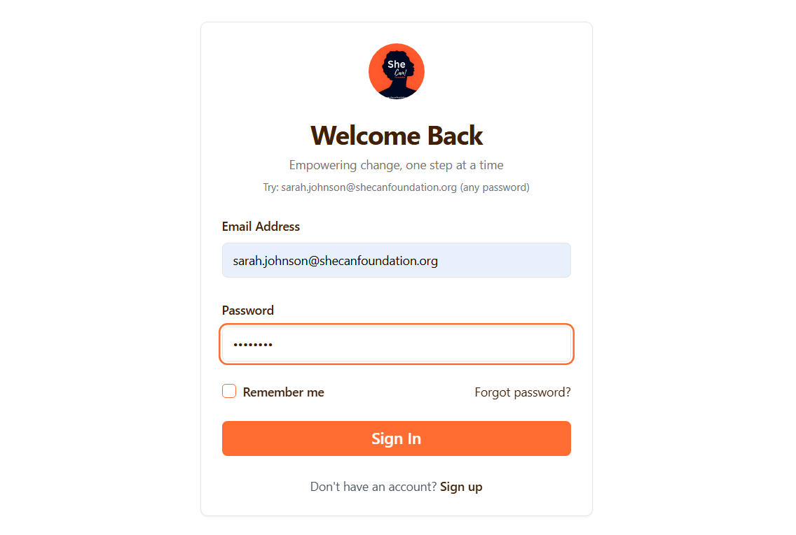
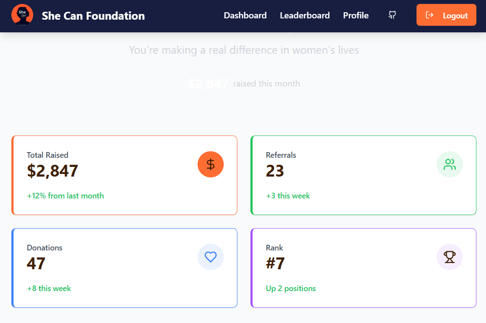
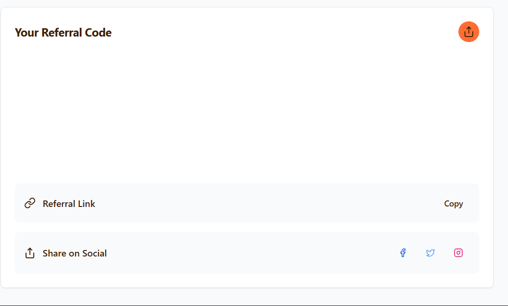
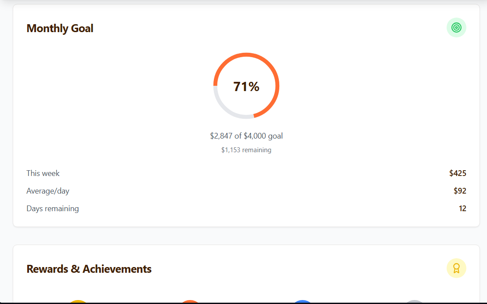
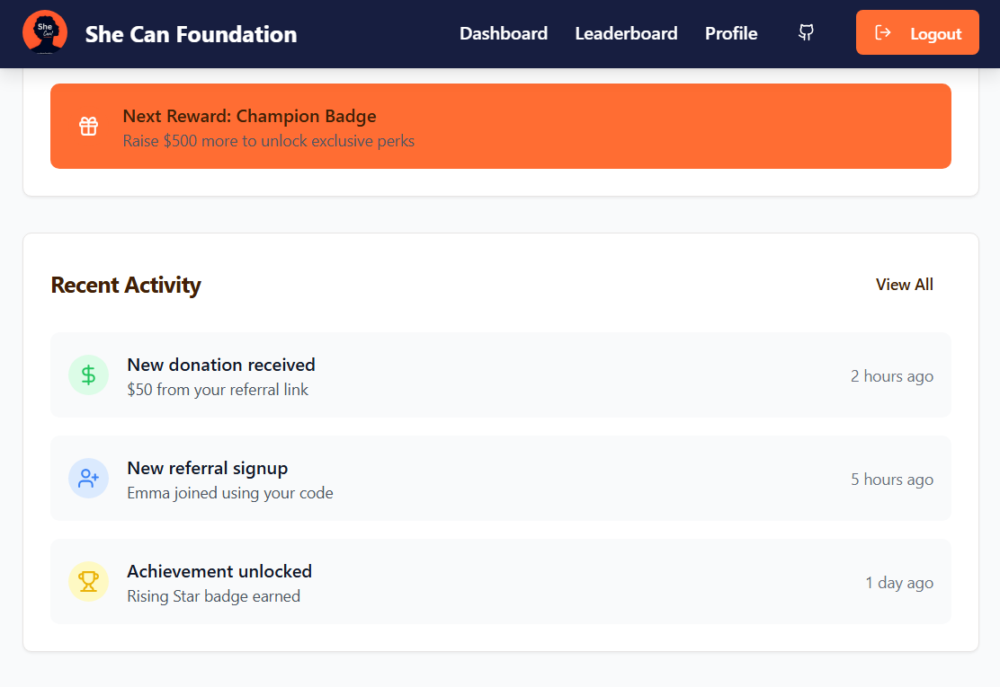
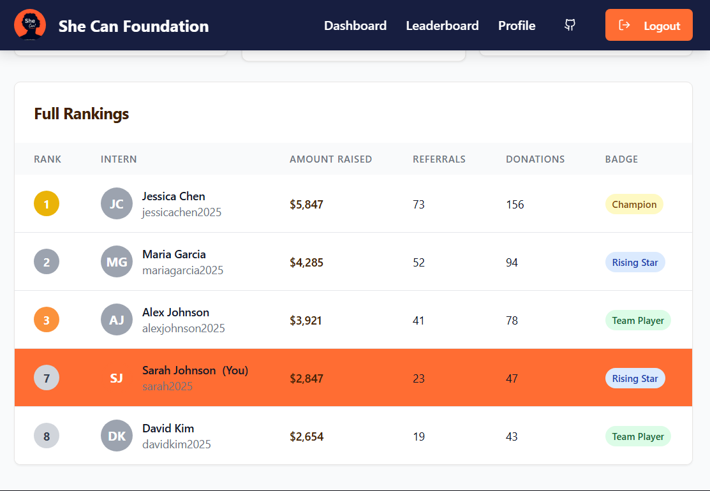
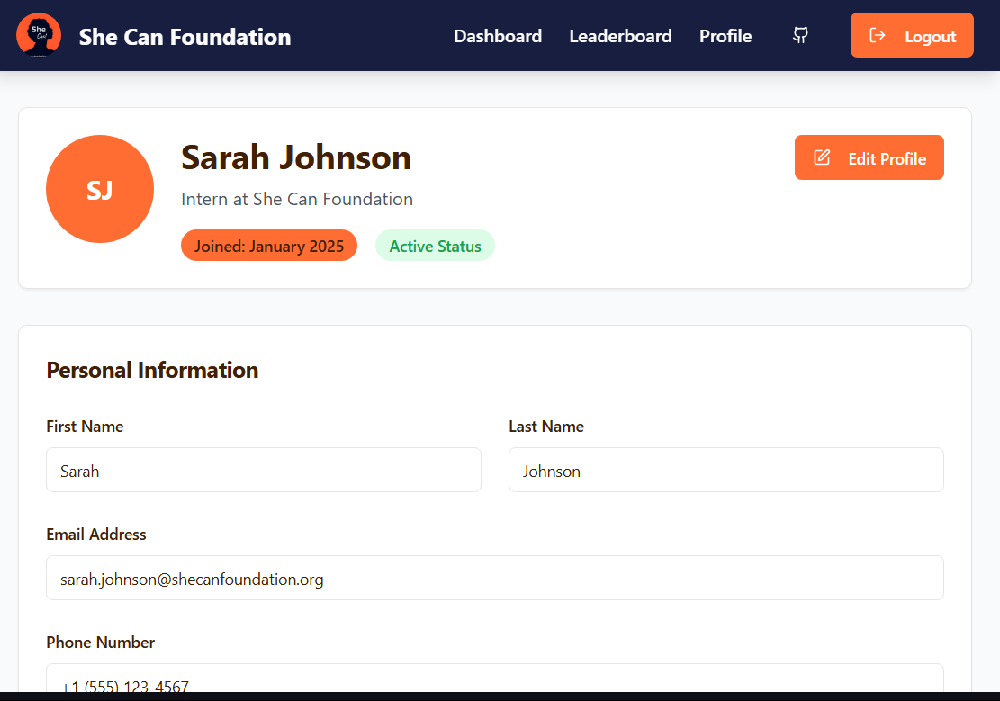

# 🌸 She Can Foundation — Round 1 Assignment

A full-stack dashboard application empowering interns to manage and track their fundraising activities for the **She Can Foundation**. Designed with accessibility, clarity, and growth in mind, the platform supports interns with live progress updates, achievement tracking, leaderboards, and personal management tools.

---

## 📸 Preview
### 🔗 Login

### 🏠 Dashboard  

### 🏆 Leaderboard  

### 👤 Profile Management  

---

## ✨ Recent Highlights

- ✅ Full dashboard with intern stats, charts, and activities  
- 🔗 Real-time referral tracking and leaderboard rankings  
- 🏅 Achievements system with badges and gamification  
- 👤 Profile management with edit & view features  
- 🎨 Fully branded UI with She Can Foundation theme  
- ✅ REST API with dummy data and authentication  
- 🧪 Meets all Round 1 Task requirements  

---

## 🏗️ Architecture Overview

### 🖼️ Frontend
- **React 18 + TypeScript**
- **Routing**: Wouter
- **State**: Context API + TanStack Query
- **UI**: Tailwind CSS + Shadcn/UI
- **Build Tool**: Vite

### 🔧 Backend
- **Node.js + Express (TypeScript)**
- **REST APIs** for interns, activities, achievements
- **Auth**: Email-based login
- **Data**: Drizzle ORM + Neon PostgreSQL

---

### Database Design
- **ORM**: Drizzle ORM with PostgreSQL dialect for type-safe database operations
- **Schema**: Three main entities - interns, activities, and achievements with proper relationships
- **Migration**: Drizzle Kit for database schema management and migrations

### Styling and Design System
- **CSS Framework**: Tailwind CSS with custom CSS variables for theming
- **Component Library**: Shadcn/ui providing consistent, accessible components
- **Design Tokens**: Custom She Can Foundation brand colors (orange primary, navy secondary)
- **Responsive Design**: Mobile-first approach with responsive breakpoints

### Development and Build Process
- **Development Server**: Vite dev server with Hot Module Replacement
- **Production Build**: Vite for frontend bundling, esbuild for backend compilation
- **Type Checking**: TypeScript compiler for static type analysis
- **Code Quality**: ESNext modules with strict TypeScript configuration

## External Dependencies

### Core Framework Dependencies
- **React Ecosystem**: React 18, React DOM, React Router (Wouter)
- **TypeScript**: Full TypeScript support across frontend and backend
- **Node.js Runtime**: Express.js for server framework

### Database and ORM
- **Neon Database**: PostgreSQL-compatible serverless database (@neondatabase/serverless)
- **Drizzle ORM**: Type-safe database operations (drizzle-orm, drizzle-zod)
- **Database Validation**: Zod for schema validation and type inference

### UI and Styling
- **Radix UI**: Comprehensive accessible component primitives
- **Tailwind CSS**: Utility-first CSS framework with PostCSS processing
- **Lucide React**: Consistent icon library for UI elements
- **Class Variance Authority**: Component variant management

### Development Tools
- **Vite**: Build tool and development server
- **ESBuild**: JavaScript/TypeScript bundler for production
- **TanStack Query**: Server state management and caching
- **React Hook Form**: Form handling with validation

### Third-party Integrations
- **Date Utilities**: date-fns for date manipulation and formatting
- **Session Management**: connect-pg-simple for PostgreSQL session storage
- **Development Enhancement**: Replit-specific plugins for development environment optimization
